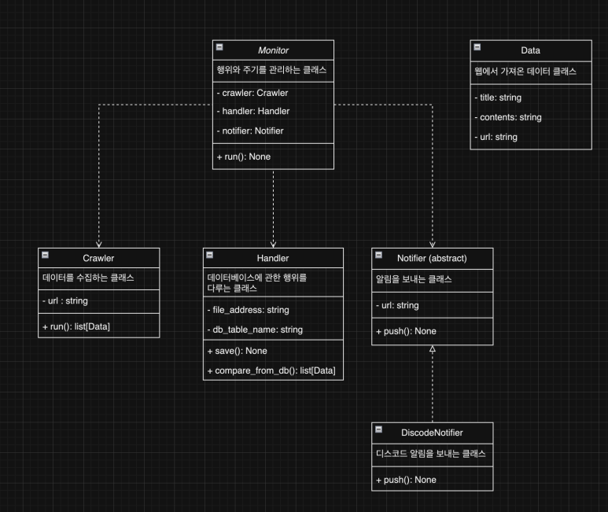

# lataleplus_discord_webhook

라테일플러스 커뮤니티에서 새 글이 올라오면, 해당 글을 확인 후 디스코드로 알람을 보내는 기능 개발


---

### 문제
해당 커뮤니티에 여러 이벤트 글과 쿠폰 게시글 등이 올라오는데, 해당 이벤트와 쿠폰 발행 게시글을 
일일이 찾아 새로고침하는  시간이 너무 비효율적이고, 요즘은 선착순 쿠폰도 있어서 해당 게시글을 바로 확인하도록 하는 필요성을 느낌  

자주 사용하는 게임 SNS로는 디스코드가 있어서 이걸로 진행하기로 결정


### 설계 및 구현


서버에 있는 파이썬 스크립트가 해당 웹 사이트의 데이터를 크롤링하여 DB에 있는 내용과 비교 후,
DB에 없는 내용(새 게시글)이면 디스코드 웹 훅을 이용하여 각 채널에 맞는 게시글 내용을 전달하는 식으로 구성




각 기능에 따라 클래스로 쪼개서 분류함. 처음에는 Crawler 클래스 안에 모든 기능을 넣으려고 했으나,
추후 카톡이나 다른 SNS 알람도 받아야 할 상황도 있을 거 같아 확장성을 위해 기능에 따라 클래스를 분리해서 처리 


### 결과


스케쥴링을 통해 매 주기마다 웹 사이트에서 크롤링한 데이터를 필터링 하여 새로 올라온 게시글만
알람이 전송해주는 모습


---

### 설치 및 실행

1. python 설치 (https://www.python.org/)
2. 파이썬 가상환경 설정 후 패키지 설치, `pip install -r requirements.txt`
3. .env 파일 값 추가, #으로 주석처리한 곳에 값을 추가. 디스코드 채널 훅 API 사용법은 https://jheaon.tistory.com/282 참고
```python
# 디스코드 채널 훅 API

#공지사항 -> DISCORD_ANNOUNCEMENT_API=
#업데이트 -> DISCORD_INSPECTION_UPDATE_API=
#개발자노트 -> DISCORD_DEVELOPER_NOTE_API=
#이벤트 -> DISCORD_EVENT_API=
#이벤트 당첨자 -> DISCORD_EVENT_WINNER_API=
#자유게시판 -> DISCORD_FREE_BULLET_IN_BOARD_API=
#에러 알림 -> DISCORD_ERROR_API=

# 라테일 플러스 이벤트 API
ANNOUNCEMENT_API=https://comm-api.game.naver.com/nng_main/v1/community/lounge/Latale_Plus/feed?boardId=3&buffFilteringYN=N&limit=25&offset=0&order=NEW
INSPECTION_UPDATE_API=https://comm-api.game.naver.com/nng_main/v1/community/lounge/Latale_Plus/feed?boardId=11&buffFilteringYN=N&limit=25&offset=0&order=NEW
DEVELOPER_NOTE_API=https://comm-api.game.naver.com/nng_main/v1/community/lounge/Latale_Plus/feed?boardId=34&buffFilteringYN=N&limit=25&offset=0&order=NEW
EVENT_API=https://comm-api.game.naver.com/nng_main/v1/community/lounge/latale_plus/feed?boardId=12&buffFilteringYN=N&limit=25&offset=0&order=NEW
EVENT_WINNER_API=https://comm-api.game.naver.com/nng_main/v1/community/lounge/Latale_Plus/feed?boardId=13&buffFilteringYN=N&limit=25&offset=0&order=NEW
FREE_BULLET_IN_BOARD=https://comm-api.game.naver.com/nng_main/v1/community/lounge/Latale_Plus/feed?boardId=4&buffFilteringYN=N&limit=25&offset=0&order=NEW

# DB파일 위치
#DB=

# 디스코드 썸네일 이미지
FREERLING_IMG=https://pbs.twimg.com/media/D_qCTf-UIAAdARi.jpg:large
```
4. main함수 실행 `python main.py`


### 주요 기능 

- 디스코드로 알람 전송 (apscheduler, requests 패키지 사용)
- 스크립트 에러 발생시 디스코드 알람 전송 (logging, requests 패키지 사용)
- DB ORM (sqlalchemy 패키지 사용)


----

### 버그 해결

- 서버를 재가동하면, 받았던 알림을 또 다시 보내는 현상 

무료서버를 사용해서 하루에 1번 중단되서 재가동 해야하는데 스크립트와 DB를 한 서버에 두다보니 서버 중단되고 재가동시 DB안에 있던 내용이 초기화 되어 처음 크롤링한 내용을 다시 알람을 보내는 것을 확인. 스크립트서버와 DB서버를 분리해 관리함으로써 해결


- 받았던 알림이 스케쥴링 시간에 따라 한개씩 다시 보내지는 현상

원래는 게시글 25개와, DB에 저장된 최근 게시글 25개를 비교해서 크롤링한 데이터가 DB에 저장되지 않았다면, 새로운 게시글로 처리하여 알람을 보내는식으로 구현.
하지만 크롤링 했던 게시글이 수정되거나 삭제될 경우 DB와 비교하는 과정에서 이러한 문제가 생겼음을 확인. 한번 크롤링 할 때 25개의 게시글만 가져오니까, DB에는 최근 데이터 50개와 비교하여 새로운 게시글을 찾도록 변경하여 해결


