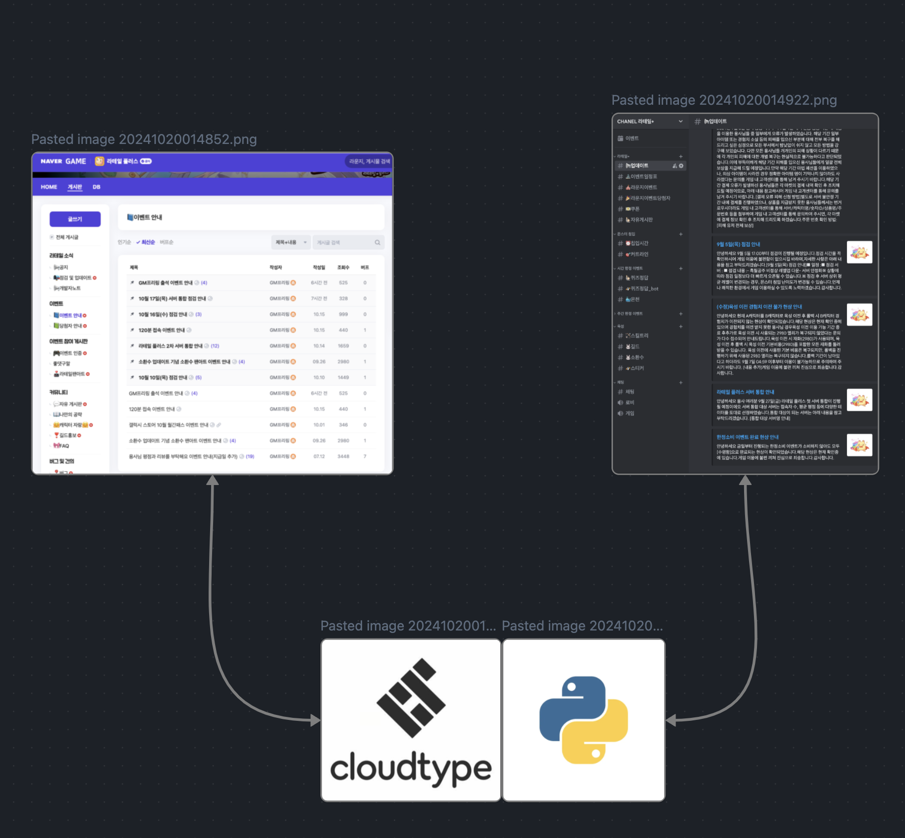
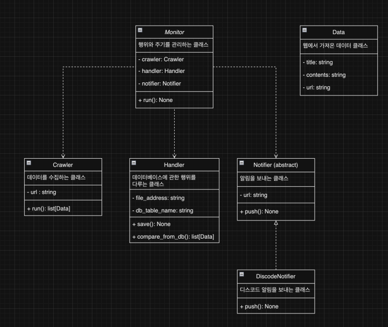
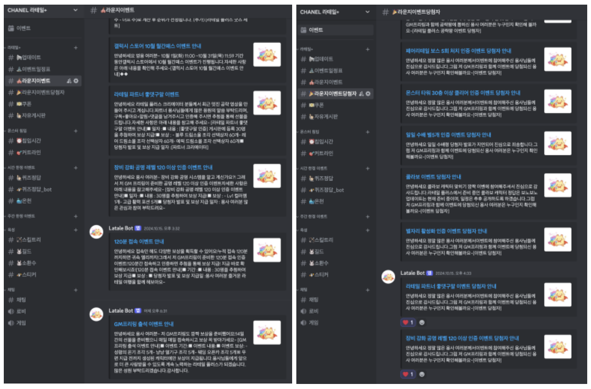

# lataleplus_discord_webhook

라테일플러스 커뮤니티에서 새 글이 올라오면, 해당 글을 디스코드로 알람을 보내는 프로젝트 입니다. 


---

### 문제
해당 커뮤니티에 여러 이벤트 글과 쿠폰 발행이 이루어지는데, 해당 이벤트와 쿠폰 발행을 기다리는
시간이 너무 비 효율적이라 느껴 자주 사용하는 디스코드로 알람을 받아 확인하고자 했다.


### 설계 및 구현


서버에 있는 파이썬 스크립트가 해당 웹 사이트의 데이터를 크롤링하여 DB에 있는 내용과 비교 후,
DB에 없는 내용이면 디스코드 웹 훅을 이용하여 각 채널에 맞는 내용을 전달하는 식으로 구상했다.




각 기능에 맞는 클래스를 구현하여 처리했다. 처음에는 Crawler 클래스 안에 모든 기능을 넣으려고 했으나,
다른 SNS 알람도 받아야 할 상황도 있을 거 같아 확장성을 위해 기능에 따라 클래스를 분리했다. 


### 결과


스케쥴링을 통해 매 주기마다 웹 사이트에서 크롤링한 데이터를 필터링 하여 새로 올라온 게시글만
알람이 전송되고 있다.


---

### 설치 및 실행

1. python 설치 (https://www.python.org/)
2. 가상환경 설정 후, `pip install -r requirements.txt`
3. .env 파일 값 추가, #으로 주석처리한 곳에 값을 넣어주시면 됩니다. 
```python
# 디스코드 채널 훅 API


#공지사항 -> DISCORD_ANNOUNCEMENT_API=
#업데이트 -> DISCORD_INSPECTION_UPDATE_API=
#개발자노트 -> DISCORD_DEVELOPER_NOTE_API=
#이벤트 -> DISCORD_EVENT_API=
#이벤트 당첨자 -> DISCORD_EVENT_WINNER_API=
#자유게시판 -> DISCORD_FREE_BULLET_IN_BOARD_API=
#에러 알림 -> DISCORD_ERROR_API=

# 라테일 플러스 이벤트 API
ANNOUNCEMENT_API=https://comm-api.game.naver.com/nng_main/v1/community/lounge/Latale_Plus/feed?boardId=3&buffFilteringYN=N&limit=25&offset=0&order=NEW
INSPECTION_UPDATE_API=https://comm-api.game.naver.com/nng_main/v1/community/lounge/Latale_Plus/feed?boardId=11&buffFilteringYN=N&limit=25&offset=0&order=NEW
DEVELOPER_NOTE_API=https://comm-api.game.naver.com/nng_main/v1/community/lounge/Latale_Plus/feed?boardId=34&buffFilteringYN=N&limit=25&offset=0&order=NEW
EVENT_API=https://comm-api.game.naver.com/nng_main/v1/community/lounge/latale_plus/feed?boardId=12&buffFilteringYN=N&limit=25&offset=0&order=NEW
EVENT_WINNER_API=https://comm-api.game.naver.com/nng_main/v1/community/lounge/Latale_Plus/feed?boardId=13&buffFilteringYN=N&limit=25&offset=0&order=NEW
FREE_BULLET_IN_BOARD=https://comm-api.game.naver.com/nng_main/v1/community/lounge/Latale_Plus/feed?boardId=4&buffFilteringYN=N&limit=25&offset=0&order=NEW

# DB파일 위치
#DB=


# 디스코드 썸네일 이미지
FREERLING_IMG=https://pbs.twimg.com/media/D_qCTf-UIAAdARi.jpg:large
```
4. main함수 실행 `python main.py`


### 주요 기능 

- apscheduler 패키지를 이용해 스케쥴링 기능으로 크롤링 및 디스코드 알림 전송 기능
- logging을 통한 스크립트 실행 중 에러 발생 시 디스코드 알림 전송 기능
- sqlalchemy을 통한 db 관리 기능